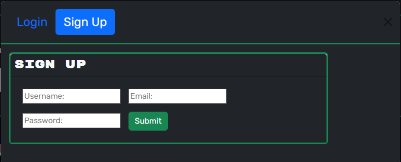

# BS-Engine: Your Ultimate Book Discovery and Saving Platform 📚
[](https://opensource.org/licenses/MIT)

## Table of Contents
- [Description.](#description)
- [Usage Tips.](#usage)
- [Installation](#installation)
- [Contributing](#contributing)
- [License](#license)

<a name='description'></a>
Welcome to BS-Engine, your one-stop destination for discovering and saving your favorite books! Whether you're a bibliophile, a casual reader, or simply looking for your next literary adventure, BS-Engine has got you covered.

🔎 **Discover New Reads:** Dive into a vast collection of books spanning various genres, from thrilling mysteries to heartwarming romances. Our powerful search engine allows you to explore books by title, author, or keywords, ensuring you never miss out on your next great read.

📚 **Build Your Personal Library:** Found a book that resonates with you? Save it to your personalized library with a single click. Keep track of the books you've read, want to read, or recommend to friends and fellow readers.

🌟 **Hover-Friendly Descriptions:** Easily preview book descriptions by simply hovering over the book cover. Uncover intriguing plot lines, captivating characters, and thrilling twists without clicking away from the main page.

📖 **Detailed Information:** Get comprehensive details about each book, including author information, cover images, and concise summaries. Make informed decisions about which books to add to your collection.

🚀 **User-Friendly Interface:** BS-Engine's sleek and intuitive design ensures a seamless browsing experience. No clutter, no confusion—just a straightforward way to find and save your favorite books.

⚡️ **Lightning-Fast Searches:** With BS-Engine's lightning-fast search functionality, you'll have the power of thousands of books at your fingertips in seconds.

📣 **Share Your Favorites:** Found a book you can't stop raving about? Spread the love by sharing your favorites on social media, inspiring others to embark on their reading journey.

Ready to dive into the world of books? Visit BS-Engine today and start exploring, discovering, and saving your next literary adventure!

*BS-Engine: Bringing the world of books to your fingertips.*




<a name='usage'></a>
## Usage
Us ```npm run dev```

<a name='installation'></a>
## Installation
Us ```npm i``` to download all required dependencies. Make sure you're in the 'Develop' folder when running the command.

<a name='contributing'></a>
## Contributing
AntimatterNova and [Google's Book API](https://developers.google.com/books) 

<a name='license'></a>
## License
This project is licensed under the [MIT](https://choosealicense.com/licenses/mit/) license.
