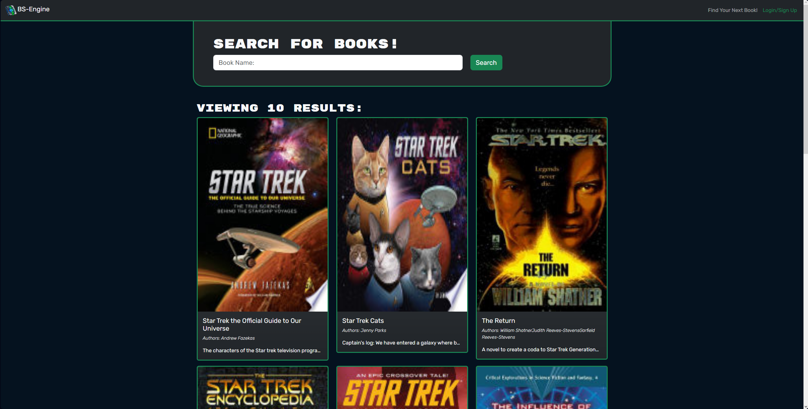
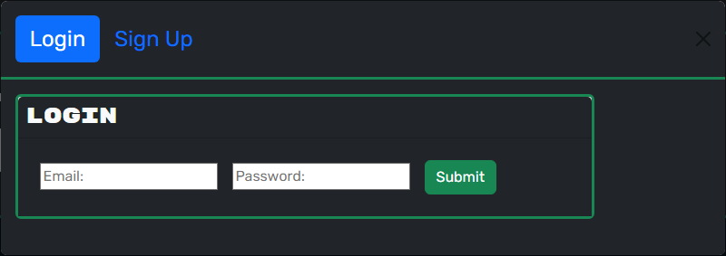

# BS-Engine
[](https://opensource.org/licenses/MIT)

## Table of Contents
- [Description.](#description)
- [Usage Tips.](#usage)
- [Installation](#installation)
- [Contributing](#contributing)
- [License](#license)

<a name='description'></a>
## Product Description
Welcome to BS-Engine, your one-stop destination for managing your reading journey. BS-Engine is a user-friendly website designed for book enthusiasts who want to explore, discover, and keep track of their favorite books. Whether you're an avid reader, a casual browser, or just getting started on your reading journey, BS-Engine has something special for you.





<a name='usage'></a>
## Usage
Us ```npm run dev```

<a name='installation'></a>
## Installation
Us ```npm i``` to download all required dependencies. Make sure you're in the 'Develop' folder when running the command.

<a name='contributing'></a>
## Contributing
AntimatterNova

<a name='license'></a>
## License
This project is licensed under the [MIT](https://choosealicense.com/licenses/mit/) license.
